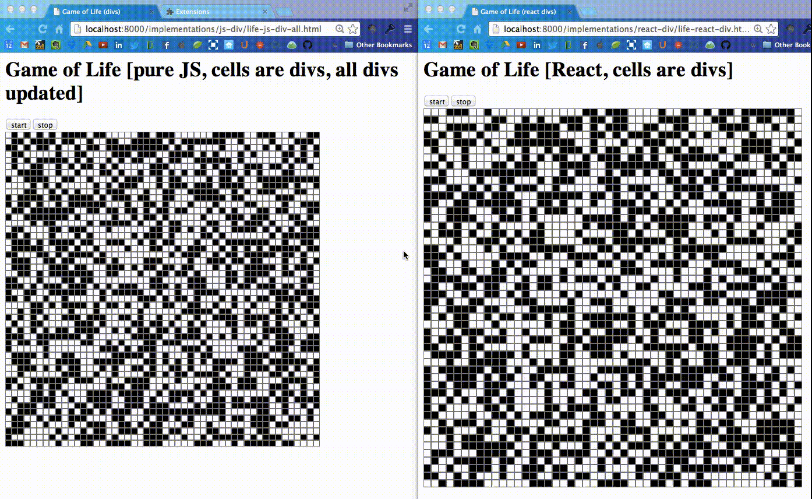

## Game of Life in Javascript

This is a minimal implementation of Conway's Game of Life, for the purposes of exploring 
different Javascript user interface frameworks.  

So far there are implementations using:
- native Javascript graphics (HTML5 canvas)
- D3.js (SVG)
- React.js (SVG)  


### Installation

Clone this repo:

```bash
[rule146@rule146: code]$ git clone https://github.com/jskelcy/life.git
Cloning into 'life'...
remote: Counting objects: 178, done.
remote: Compressing objects: 100% (124/124), done.
remote: Total 178 (delta 70), reused 147 (delta 53)
Receiving objects: 100% (178/178), 259.97 KiB | 0 bytes/s, done.
Resolving deltas: 100% (70/70), done.
Checking connectivity... done.
[rule146@rule146: code]$ cd life/
```

Start a local http server in the repo (here I'm using port 8000) and open http://localhost:8000 in chrome:

```bash
[rule146@rule146: life]$ python -m SimpleHTTPServer 8000 &
[1] 3548
[rule146@rule146: life]$ Serving HTTP on 0.0.0.0 port 8000 ...
[rule146@rule146: life]$ open -a /Applications/Google\ Chrome.app/ http://localhost:8000
```

You should see a grid and some buttons for controlling the update animation:


The animation should look something like this:


### React vs pure JS

It's interesting to compare the number of DOM mutations done by pure JS vs React.
Below is a screencast where I'm using my [Chrome browser extension](https://github.com/paul-jean/dom-viz) 
to show the divs being mutated in the grid by pure JS and React implementations.
JS has to update every cell div each time, so every cell is highlighted by the
browser extension at each step. Whereas React maintains a _virtual DOM_, only 
pushing _diffs_ of the vDOM to the DOM, so only the cell divs changing value are
mutated:




### Project page

See the project page [here](http://jskelcy.github.io/life/).
